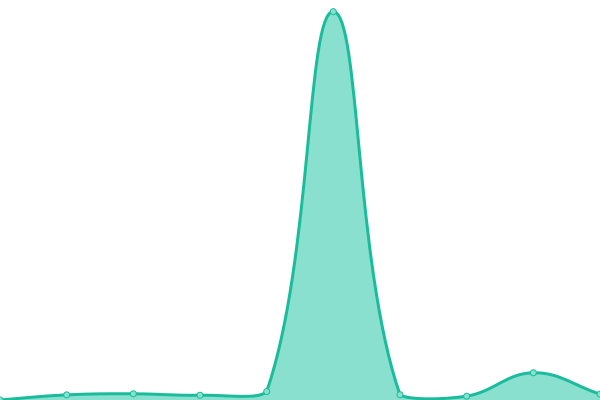

# [📈 Live Status](https://tedvdb.github.io/feddit-status): <!--live status--> **🟩 All systems operational**

This repository contains the open-source uptime monitor and status page for [Ted van den Brink](https://peejseej.nl), powered by [Upptime](https://github.com/upptime/upptime).

With [Upptime](https://upptime.js.org), you can get your own unlimited and free uptime monitor and status page, powered entirely by a GitHub repository. We use [Issues](https://github.com/tedvdb/feddit-status/issues) as incident reports, [Actions](https://github.com/tedvdb/feddit-status/actions) as uptime monitors, and [Pages](https://tedvdb.github.io/feddit-status) for the status page.

<!--start: status pages-->
<!-- This summary is generated by Upptime (https://github.com/upptime/upptime) -->
<!-- Do not edit this manually, your changes will be overwritten -->
<!-- prettier-ignore -->
| URL | Status | History | Response Time | Uptime |
| --- | ------ | ------- | ------------- | ------ |
|  [Front-end](https://feddit.nl) | 🟩 Up | [front-end.yml](https://github.com/tedvdb/feddit-status/commits/HEAD/history/front-end.yml) | 

 902ms
     
 | 

<a href="https://status.feddit.nl/history/front-end">97.25%</a>
    

|  [Back-end](https://feddit.nl/nodeinfo/2.0.json) | 🟩 Up | [back-end.yml](https://github.com/tedvdb/feddit-status/commits/HEAD/history/back-end.yml) | 

 212ms
     
 | 

<a href="https://status.feddit.nl/history/back-end">97.25%</a>
    

|  [Photon front-end](https://ph.feddit.nl) | 🟩 Up | [photon-front-end.yml](https://github.com/tedvdb/feddit-status/commits/HEAD/history/photon-front-end.yml) | 

 416ms
     
 | 

<a href="https://status.feddit.nl/history/photon-front-end">96.79%</a>
    

<!--end: status pages-->

[**Visit our status website →**](https://tedvdb.github.io/feddit-status)

## 📄 License

- Powered by: [Upptime](https://github.com/upptime/upptime)
- Code: [MIT](./LICENSE) © [Ted van den Brink](https://peejseej.nl)
- Data in the `./history` directory: [Open Database License](https://opendatacommons.org/licenses/odbl/1-0/)
